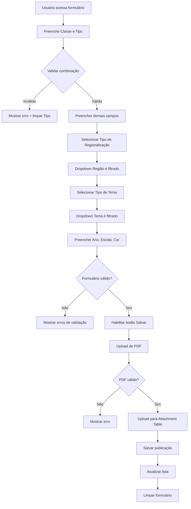
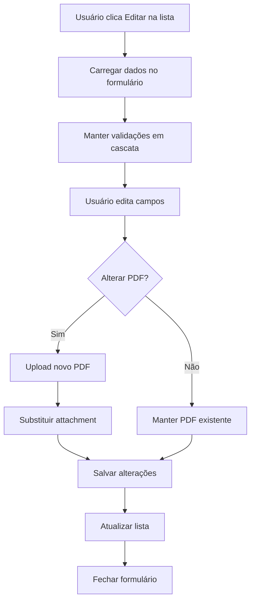

# 📚 MAPOTECA DIGITAL - DOCUMENTAÇÃO COMPLETA
# Todos os 4 arquivos de desenvolvimento em um único documento

---
---

# 1️⃣ FEATURE-SERVICES-CONFIG.md (Backend)

# 🗺️ Feature Services Configuration - Mapoteca Digital

## 📋 Visão Geral

Este documento detalha a configuração dos Feature Services do ArcGIS para a Mapoteca Digital, incluindo a publicação das tabelas PostgreSQL e configuração de Attachments.

---

## 🎯 Objetivo dos Feature Services

Os Feature Services funcionam como a **camada de backend** do sistema, expondo as tabelas PostgreSQL através de APIs REST nativas do ArcGIS, permitindo:

- ✅ CRUD (Create, Read, Update, Delete) de registros
- ✅ Queries e filtros avançados
- ✅ Upload/download de attachments (PDFs)
- ✅ Autenticação integrada com ArcGIS Portal
- ✅ Versionamento e controle de transações

**IMPORTANTE:** NÃO criar API REST customizada. Usar Feature Services nativos do ArcGIS.

---

## 📊 Feature Services a Serem Criados

### 1. **FS_Mapoteca_Dominios** (Tabelas de Lookup)

**Propósito:** Fornecer dados de domínio para dropdowns e validações

**Feature Layers:**
```
├── t_classe_mapa              (2 registros)
├── t_tipo_mapa                (3 registros)
├── t_anos                     (33 registros)
├── t_escala                   (9 registros)
├── t_cor                      (2 registros)
├── t_tipo_tema                (6 registros)
├── t_tipo_regionalizacao      (11 registros)
├── t_regiao                   (106 registros)
└── t_tema                     (55 registros)
```

**Configurações:**
- **Capabilities:** Query, Sync
- **Max Records:** 1000
- **Allow Geometry Updates:** false (não espacial)
- **Enable Z Values:** false
- **Enable M Values:** false

**Índices Recomendados:**
```sql
-- Já criados no script 01-setup-schema-CORRECTED.sql
CREATE INDEX idx_t_classe_mapa_nome ON t_classe_mapa(nome_classe_mapa);
CREATE INDEX idx_t_tipo_mapa_nome ON t_tipo_mapa(nome_tipo_mapa);
CREATE INDEX idx_t_tema_codigo ON t_tema(codigo_tema);
```

---

### 2. **FS_Mapoteca_Relacionamentos** (Tabelas N:N)

**Propósito:** Validações em cascata para dropdowns

**Feature Layers:**
```
├── t_classe_mapa_tipo_mapa    (6 combinações válidas)
├── t_regionalizacao_regiao    (229 relacionamentos)
└── t_tipo_tema_tema           (55 relacionamentos)
```

**Configurações:**
- **Capabilities:** Query
- **Max Records:** 500
- **Allow Geometry Updates:** false

**Queries Importantes:**
```javascript
// Exemplo: Buscar tipos de mapa válidos para uma classe
where: "id_classe_mapa = '01'"
outFields: ["id_tipo_mapa"]

// Exemplo: Buscar temas válidos para um tipo de tema
where: "id_tipo_tema = 'TTM01'"
outFields: ["id_tema"]
```

---

### 3. **FS_Mapoteca_Municipios**

**Propósito:** Dados de municípios da Bahia

**Feature Layers:**
```
└── t_municipios               (417 registros)
```

**Configurações:**
- **Capabilities:** Query
- **Max Records:** 500
- **Allow Geometry Updates:** false
- **Definition Query:** `ativo = true` (apenas municípios ativos)

---

### 4. **FS_Mapoteca_Publicacoes** ⭐ PRINCIPAL

**Propósito:** Gestão de publicações (CRUD completo)

**Feature Layers:**
```
├── t_publicacao               (Estaduais/Regionais)
└── t_publicacao_municipios    (Municipais)
```

**Configurações:**
- **Capabilities:** Create, Delete, Query, Update, Editing, Sync
- **Max Records:** 2000
- **Allow Geometry Updates:** false
- **Enable Attachments:** **TRUE** ⚠️
- **Max Attachment Size:** 50 MB
- **Supported Attachment Types:** application/pdf

**GlobalID:** Obrigatório para Attachments
```sql
-- Já configurado no schema
globalid UUID NOT NULL DEFAULT uuid_generate_v4() UNIQUE
```

**Operações Suportadas:**
```javascript
// CREATE
POST /FS_Mapoteca_Publicacoes/0/addFeatures

// READ
GET /FS_Mapoteca_Publicacoes/0/query

// UPDATE
POST /FS_Mapoteca_Publicacoes/0/updateFeatures

// DELETE
POST /FS_Mapoteca_Publicacoes/0/deleteFeatures

// ATTACHMENTS
POST /FS_Mapoteca_Publicacoes/0/{objectId}/addAttachment
GET /FS_Mapoteca_Publicacoes/0/{objectId}/attachments
DELETE /FS_Mapoteca_Publicacoes/0/{objectId}/deleteAttachments
```

---

## 🔧 Configuração Passo a Passo

### Pré-requisitos

1. ✅ ArcGIS Enterprise 10.9+ ou ArcGIS Online
2. ✅ ArcGIS Server com licença Advanced
3. ✅ PostgreSQL 14+ com SDE instalado
4. ✅ Database Connection configurada no ArcGIS Pro
5. ✅ Usuário com permissão de publicação

---

### Passo 1: Registrar Database no ArcGIS Server

**Via ArcGIS Server Manager:**

```
1. Acessar: https://servidor:6443/arcgis/manager
2. Site → Data Store → Register Database
3. Configurar:
   - Name: mapoteca_db
   - Type: PostgreSQL
   - Server: 10.28.246.75
   - Database: mapoteca
   - Schema: dados_mapoteca
   - Authentication: Database
   - Username: dados_mapoteca
   - Password: [senha]
```

**Validar Conexão:**
```sql
-- Testar query no ArcGIS Server
SELECT COUNT(*) FROM dados_mapoteca.t_classe_mapa;
-- Deve retornar: 2
```

---

### Passo 2: Criar Feature Services no ArcGIS Pro

**1. Abrir ArcGIS Pro**

**2. Conectar ao PostgreSQL:**
```
Catalog Pane → Databases → New Database Connection
- Database Platform: PostgreSQL
- Instance: 10.28.246.75
- Authentication Type: Database authentication
- User name: dados_mapoteca
- Password: [senha]
- Database: mapoteca
```

**3. Adicionar Tabelas ao Mapa:**
```
Catalog → Database Connection → dados_mapoteca schema
Arrastar tabelas para o mapa (sem geometria - standalone tables)
```

**4. Configurar Propriedades das Tabelas:**

Para **t_publicacao**:
```
Right-click → Properties → General
- Enable Attachments: ✓
- GlobalID Field: globalid
- Attachment Table: t_publicacao__attach
- Relationship Class: rel_globalid
```

Para **t_publicacao_municipios**:
```
Right-click → Properties → General
- Enable Attachments: ✓
- GlobalID Field: globalid
- Attachment Table: t_publicacao_municipios_attach
- Relationship Class: rel_globalid
```

**5. Publicar Feature Service:**
```
Share → Web Layer → Publish Web Layer

Configuration:
- Name: FS_Mapoteca_Publicacoes
- Summary: Feature Service para gestão de publicações da Mapoteca Digital
- Tags: mapoteca, publicacoes, bahia, sei
- Layer Type: Feature
- Location: My Content (ou pasta específica)

Settings → Configuration:
✓ Feature Access
✓ Create, Delete, Query, Sync, Update, Editing
✓ Enable Attachments (para t_publicacao e t_publicacao_municipios)

Settings → Feature Access:
- Maximum Records: 2000
- Allow Geometry Updates: false

Settings → Attachments:
- Max Attachment Size: 50 MB
- Supported Types: application/pdf
```

---

### Passo 3: Configurar Relacionamentos para Attachments

**Criar Relationship Classes:**

```python
# Script Python no ArcGIS Pro
import arcpy

# Configurar workspace
arcpy.env.workspace = "Database Connections/mapoteca.sde"

# Criar relacionamento para publicações estaduais/regionais
arcpy.management.CreateRelationshipClass(
    origin_table="dados_mapoteca.t_publicacao",
    destination_table="dados_mapoteca.t_publicacao__attach",
    out_relationship_class="dados_mapoteca.t_publicacao__ATTACHREL",
    relationship_type="COMPOSITE",
    forward_label="Attachments",
    backward_label="Features",
    message_direction="FORWARD",
    cardinality="ONE_TO_MANY",
    origin_primary_key="globalid",
    origin_foreign_key="rel_globalid"
)

# Criar relacionamento para publicações municipais
arcpy.management.CreateRelationshipClass(
    origin_table="dados_mapoteca.t_publicacao_municipios",
    destination_table="dados_mapoteca.t_publicacao_municipios_attach",
    out_relationship_class="dados_mapoteca.t_publicacao_municipios__ATTACHREL",
    relationship_type="COMPOSITE",
    forward_label="Attachments",
    backward_label="Features",
    message_direction="FORWARD",
    cardinality="ONE_TO_MANY",
    origin_primary_key="globalid",
    origin_foreign_key="rel_globalid"
)

print("Relationship classes criadas com sucesso!")
```

---

### Passo 4: Configurar Permissões

**Via ArcGIS Portal:**

```
1. Acessar Feature Service publicado
2. Settings → Sharing
3. Configurar:
   - Share with: Organization (ou grupo específico)
   - Access: Editor (para os 2 técnicos)
   - Viewer: Everyone in Organization (para consultas)

4. Settings → Feature Layers → Editing
   - Allow editors to:
     ✓ Add features
     ✓ Delete features
     ✓ Update features
     ✓ Add, update, delete attachments
   - Track created and updated info: ✓
```

---

## 🧪 Testes de Validação

### Teste 1: Query Básico

```javascript
// Via ArcGIS REST API
https://servidor/arcgis/rest/services/FS_Mapoteca_Publicacoes/FeatureServer/0/query

Parâmetros:
{
  "where": "1=1",
  "outFields": "*",
  "returnGeometry": false,
  "f": "json"
}

// Deve retornar registros em JSON
```

### Teste 2: Validação em Cascata

```javascript
// Buscar tipos válidos para classe '01' (Mapa)
https://servidor/arcgis/rest/services/FS_Mapoteca_Relacionamentos/FeatureServer/0/query

Parâmetros:
{
  "where": "id_classe_mapa = '01'",
  "outFields": "id_tipo_mapa",
  "returnGeometry": false,
  "f": "json"
}

// Deve retornar: ['01', '02', '03'] (Estadual, Regional, Municipal)
```

### Teste 3: Upload de Attachment

```javascript
// Upload PDF para uma publicação
POST https://servidor/arcgis/rest/services/FS_Mapoteca_Publicacoes/FeatureServer/0/1/addAttachment

Form Data:
- attachment: [arquivo PDF, máx 50MB]
- f: json

// Deve retornar:
{
  "addAttachmentResult": {
    "objectId": 1,
    "globalId": "{UUID}",
    "success": true
  }
}
```

### Teste 4: Listar Attachments

```javascript
// Listar PDFs de uma publicação
GET https://servidor/arcgis/rest/services/FS_Mapoteca_Publicacoes/FeatureServer/0/1/attachments

// Deve retornar:
{
  "attachmentInfos": [
    {
      "id": 1,
      "name": "mapa_bahia_2024.pdf",
      "size": 5242880,
      "contentType": "application/pdf"
    }
  ]
}
```

---

## 📋 Checklist de Configuração

### Feature Services

- [ ] Database registrada no ArcGIS Server
- [ ] Conexão PostgreSQL testada e funcionando
- [ ] FS_Mapoteca_Dominios publicado (9 layers)
- [ ] FS_Mapoteca_Relacionamentos publicado (3 layers)
- [ ] FS_Mapoteca_Municipios publicado (1 layer)
- [ ] FS_Mapoteca_Publicacoes publicado (2 layers)

### Attachments

- [ ] Attachments habilitados em t_publicacao
- [ ] Attachments habilitados em t_publicacao_municipios
- [ ] GlobalIDs configurados corretamente
- [ ] Relationship classes criadas
- [ ] Tamanho máximo 50MB configurado
- [ ] Tipo permitido: application/pdf

### Testes

- [ ] Query básico funcionando
- [ ] Validação em cascata testada
- [ ] Upload de PDF testado (<50MB)
- [ ] Download de PDF testado
- [ ] Listagem de attachments testada
- [ ] Exclusão de attachment testada

### Segurança

- [ ] Permissões configuradas no Portal
- [ ] Editores (2 técnicos) identificados
- [ ] Viewers (organização) configurados
- [ ] Autenticação ArcGIS Enterprise ativa

---

## 🔗 URLs dos Feature Services

```
Base URL: https://servidor/arcgis/rest/services/

Feature Services:
├── FS_Mapoteca_Dominios/FeatureServer
├── FS_Mapoteca_Relacionamentos/FeatureServer
├── FS_Mapoteca_Municipios/FeatureServer
└── FS_Mapoteca_Publicacoes/FeatureServer
    ├── /0 (t_publicacao)
    └── /1 (t_publicacao_municipios)
```

---

## 📊 Queries Úteis para Experience Builder

### Carregar Dropdown de Classes
```javascript
const queryParams = {
  where: "1=1",
  outFields: ["id_classe_mapa", "nome_classe_mapa"],
  orderByFields: "id_classe_mapa",
  returnGeometry: false
};
```

### Validar Combinação Classe + Tipo
```javascript
const queryParams = {
  where: `id_classe_mapa = '${classeId}' AND id_tipo_mapa = '${tipoId}'`,
  outFields: ["id_classe_mapa"],
  returnGeometry: false
};
// Se returnCountOnly = 0, combinação inválida
```

### Carregar Temas por Tipo
```javascript
const queryParams = {
  where: `id_tipo_tema = '${tipoTemaId}'`,
  outFields: ["id_tema"],
  returnGeometry: false
};
// Usar resultado para filtrar dropdown de temas
```

---

## ⚠️ Troubleshooting

### Erro: "Unable to enable attachments"
**Causa:** GlobalID não configurado
**Solução:**
```sql
-- Adicionar GlobalID se não existir
ALTER TABLE t_publicacao
ADD COLUMN globalid UUID DEFAULT uuid_generate_v4() UNIQUE;
```

### Erro: "Attachment too large"
**Causa:** PDF > 50MB
**Solução:** Comprimir PDF ou dividir em partes

### Erro: "Invalid relationship"
**Causa:** rel_globalid não corresponde a globalid válido
**Solução:** Validar integridade referencial
```sql
SELECT * FROM vw_orphan_attachments;
```

---

**Versão:** 1.0
**Data:** 2025-11-17
**Próximo:** EXPERIENCE-BUILDER-CONFIG.md
**Status:** ✅ Pronto para Implementação


---
---
---

# 2️⃣ EXPERIENCE-BUILDER-CONFIG.md (Frontend)

# 🎨 Experience Builder Configuration - Mapoteca Digital

## 📋 Visão Geral

Este documento especifica a configuração do frontend da Mapoteca Digital usando **ArcGIS Experience Builder** com widgets nativos (100% low-code, sem customização).

**Princípio:** Minimizar código customizado, maximizar uso de widgets nativos ESRI.

---

## 🎯 Objetivo do Formulário

Substituir o processo manual de Excel (30min) por formulário automatizado (5min), incluindo:

- ✅ Cadastro de novos mapas
- ✅ Upload de PDFs via Attachments
- ✅ Validações em cascata (dropdowns inteligentes)
- ✅ Edição de registros existentes
- ✅ Visualização inline de PDFs
- ✅ Compatibilidade com 4 apps existentes

---

## 🏗️ Arquitetura da Interface

```
┌─────────────────────────────────────────────────────────────┐
│              MAPOTECA DIGITAL - CADASTRO                    │
├─────────────────────────────────────────────────────────────┤
│                                                             │
│  [Header Widget]  Logo + Título + User Info                │
│                                                             │
├─────────────────────────────────────────────────────────────┤
│                                                             │
│  ┌─────────────────┐  ┌──────────────────────────────┐    │
│  │                 │  │                              │    │
│  │   [List        │  │   [Form Widget]              │    │
│  │    Widget]      │  │                              │    │
│  │                 │  │   Campos do Formulário       │    │
│  │   Publicações   │  │   + Validações               │    │
│  │   Recentes      │  │   + Dropdowns Cascata        │    │
│  │                 │  │                              │    │
│  │   [Filtros]     │  ├──────────────────────────────┤    │
│  │                 │  │                              │    │
│  └─────────────────┘  │   [Attachment Widget]        │    │
│                       │                              │    │
│                       │   Upload de PDFs             │    │
│                       │   (Drag & Drop)              │    │
│                       │                              │    │
│                       └──────────────────────────────┘    │
│                                                             │
├─────────────────────────────────────────────────────────────┤
│  [Footer Widget]  Botões: Salvar | Cancelar | Limpar      │
└─────────────────────────────────────────────────────────────┘
```

---

## 📦 Widgets Necessários (Todos Nativos)

### 1. **Header Widget**
**Propósito:** Branding e informações do usuário

**Configuração:**
```json
{
  "type": "Header",
  "config": {
    "title": "Mapoteca Digital - Sistema de Cadastro",
    "logo": "/assets/logo-sei-ba.png",
    "showUser": true,
    "showSignOut": true,
    "links": [
      {
        "label": "Mapas Estaduais",
        "url": "/apps/mapas-estaduais"
      },
      {
        "label": "Mapas Regionais",
        "url": "/apps/mapas-regionais"
      },
      {
        "label": "Mapas Municipais",
        "url": "/apps/mapas-municipais"
      },
      {
        "label": "Cartogramas",
        "url": "/apps/cartogramas"
      }
    ]
  }
}
```

---

### 2. **Form Widget** ⭐ PRINCIPAL
**Propósito:** Formulário de cadastro com validações

**Data Source:** FS_Mapoteca_Publicacoes/0 (t_publicacao)

**Campos do Formulário:**

#### **Seção 1: Classificação**

**Campo: Classe do Mapa** (Obrigatório)
```json
{
  "fieldName": "id_classe_mapa",
  "label": "Classe do Mapa",
  "type": "dropdown",
  "required": true,
  "dataSource": "FS_Mapoteca_Dominios/t_classe_mapa",
  "displayField": "nome_classe_mapa",
  "valueField": "id_classe_mapa",
  "placeholder": "Selecione...",
  "onChange": "validateClasseTipo()"
}
```

**Campo: Tipo do Mapa** (Obrigatório)
```json
{
  "fieldName": "id_tipo_mapa",
  "label": "Tipo do Mapa",
  "type": "dropdown",
  "required": true,
  "dataSource": "FS_Mapoteca_Dominios/t_tipo_mapa",
  "displayField": "nome_tipo_mapa",
  "valueField": "id_tipo_mapa",
  "placeholder": "Selecione...",
  "onChange": "validateClasseTipo()",
  "dependsOn": "id_classe_mapa"
}
```

**Validação em Cascata:**
```javascript
// Quando usuário seleciona Classe e Tipo
// Validar se combinação é válida

function validateClasseTipo() {
  const classe = form.getFieldValue('id_classe_mapa');
  const tipo = form.getFieldValue('id_tipo_mapa');

  if (classe && tipo) {
    // Query no Feature Service de validação
    const query = {
      where: `id_classe_mapa = '${classe}' AND id_tipo_mapa = '${tipo}'`,
      returnCountOnly: true
    };

    FS_Mapoteca_Relacionamentos
      .queryFeatures(query)
      .then(result => {
        if (result.count === 0) {
          form.showError('id_tipo_mapa',
            'Combinação inválida de Classe e Tipo. Consulte a tabela de combinações válidas.');
          form.clearField('id_tipo_mapa');
        }
      });
  }
}
```

#### **Seção 2: Metadados Temporais**

**Campo: Ano de Referência** (Obrigatório)
```json
{
  "fieldName": "id_ano",
  "label": "Ano de Referência",
  "type": "dropdown",
  "required": true,
  "dataSource": "FS_Mapoteca_Dominios/t_anos",
  "displayField": "ano",
  "valueField": "id_ano",
  "orderBy": "ano DESC",
  "placeholder": "Selecione o ano..."
}
```

#### **Seção 3: Localização**

**Campo: Tipo de Regionalização** (Obrigatório)
```json
{
  "fieldName": "id_tipo_regionalizacao",
  "label": "Tipo de Regionalização",
  "type": "dropdown",
  "required": true,
  "dataSource": "FS_Mapoteca_Dominios/t_tipo_regionalizacao",
  "displayField": "nome_tipo_regionalizacao",
  "valueField": "id_tipo_regionalizacao",
  "placeholder": "Selecione...",
  "onChange": "loadRegioes()"
}
```

**Campo: Região** (Obrigatório)
```json
{
  "fieldName": "id_regiao",
  "label": "Região",
  "type": "dropdown",
  "required": true,
  "dataSource": "FS_Mapoteca_Relacionamentos/t_regionalizacao_regiao",
  "displayField": "nome_regiao",
  "valueField": "id_regiao",
  "placeholder": "Selecione primeiro o tipo de regionalização...",
  "dependsOn": "id_tipo_regionalizacao",
  "filter": "id_tipo_regionalizacao = ${id_tipo_regionalizacao}"
}
```

**Lógica de Cascata:**
```javascript
// Quando usuário seleciona Tipo de Regionalização
// Filtrar apenas regiões válidas

function loadRegioes() {
  const tipoReg = form.getFieldValue('id_tipo_regionalizacao');

  if (tipoReg) {
    // Atualizar query do dropdown de regiões
    form.updateFieldQuery('id_regiao', {
      where: `id_tipo_regionalizacao = '${tipoReg}'`
    });

    // Limpar seleção anterior
    form.clearField('id_regiao');
  }
}
```

#### **Seção 4: Tema**

**Campo: Tipo de Tema** (Obrigatório)
```json
{
  "fieldName": "id_tipo_tema",
  "label": "Tipo de Tema",
  "type": "dropdown",
  "required": true,
  "dataSource": "FS_Mapoteca_Dominios/t_tipo_tema",
  "displayField": "nome_tipo_tema",
  "valueField": "id_tipo_tema",
  "placeholder": "Selecione...",
  "onChange": "loadTemas()"
}
```

**Campo: Tema** (Obrigatório)
```json
{
  "fieldName": "id_tema",
  "label": "Tema",
  "type": "dropdown",
  "required": true,
  "dataSource": "FS_Mapoteca_Relacionamentos/t_tipo_tema_tema",
  "displayField": "nome_tema",
  "valueField": "id_tema",
  "placeholder": "Selecione primeiro o tipo de tema...",
  "dependsOn": "id_tipo_tema",
  "filter": "id_tipo_tema = ${id_tipo_tema}"
}
```

#### **Seção 5: Características Cartográficas**

**Campo: Escala** (Obrigatório)
```json
{
  "fieldName": "codigo_escala",
  "label": "Escala Cartográfica",
  "type": "dropdown",
  "required": true,
  "dataSource": "FS_Mapoteca_Dominios/t_escala",
  "displayField": "nome_escala",
  "valueField": "codigo_escala",
  "placeholder": "Selecione a escala..."
}
```

**Campo: Colorização** (Obrigatório)
```json
{
  "fieldName": "codigo_cor",
  "label": "Tipo de Colorização",
  "type": "dropdown",
  "required": true,
  "dataSource": "FS_Mapoteca_Dominios/t_cor",
  "displayField": "nome_cor",
  "valueField": "codigo_cor",
  "placeholder": "Colorido ou Preto e Branco..."
}
```

---

### 3. **Attachment Widget** ⭐ UPLOAD DE PDFs
**Propósito:** Upload, visualização e gestão de PDFs

**Configuração:**
```json
{
  "type": "Attachment",
  "dataSource": "FS_Mapoteca_Publicacoes/0",
  "config": {
    "allowAdd": true,
    "allowDelete": true,
    "allowEdit": false,
    "displayType": "list",
    "supportedFileTypes": ["application/pdf"],
    "maxFileSize": 52428800,
    "dragAndDrop": true,
    "showPreview": true,
    "inlineViewer": true,
    "messages": {
      "dragDropText": "Arraste o PDF aqui ou clique para selecionar",
      "maxSizeError": "Arquivo muito grande. Máximo: 50MB",
      "invalidTypeError": "Apenas arquivos PDF são permitidos"
    }
  }
}
```

**Validações:**
```javascript
// Validar antes de upload
function validatePDF(file) {
  // Tamanho máximo: 50MB
  if (file.size > 52428800) {
    showError('Arquivo muito grande. Máximo permitido: 50MB');
    return false;
  }

  // Tipo: apenas PDF
  if (file.type !== 'application/pdf') {
    showError('Apenas arquivos PDF são permitidos');
    return false;
  }

  // Nome do arquivo
  if (file.name.length > 255) {
    showError('Nome do arquivo muito longo (máx 255 caracteres)');
    return false;
  }

  return true;
}
```

---

### 4. **List Widget**
**Propósito:** Listar publicações recentes e permitir edição

**Data Source:** FS_Mapoteca_Publicacoes/0

**Configuração:**
```json
{
  "type": "List",
  "dataSource": "FS_Mapoteca_Publicacoes/0",
  "config": {
    "itemsPerPage": 10,
    "showPagination": true,
    "enableSearch": true,
    "sortField": "id_publicacao",
    "sortOrder": "DESC",
    "template": {
      "title": "{nome_classe_mapa} - {nome_tipo_mapa}",
      "subtitle": "{nome_tema} | {ano} | {nome_regiao}",
      "thumbnail": "default-map-icon.png",
      "actions": [
        {
          "label": "Editar",
          "action": "openForm",
          "icon": "edit"
        },
        {
          "label": "Ver PDFs",
          "action": "viewAttachments",
          "icon": "file-pdf"
        },
        {
          "label": "Excluir",
          "action": "delete",
          "icon": "trash",
          "confirm": true
        }
      ]
    },
    "filters": [
      {
        "field": "id_classe_mapa",
        "label": "Classe",
        "type": "dropdown"
      },
      {
        "field": "id_tipo_mapa",
        "label": "Tipo",
        "type": "dropdown"
      },
      {
        "field": "id_ano",
        "label": "Ano",
        "type": "dropdown"
      }
    ]
  }
}
```

---

### 5. **Button Widget**
**Propósito:** Ações do formulário

**Configuração:**
```json
{
  "type": "ButtonGroup",
  "buttons": [
    {
      "id": "btnSave",
      "label": "Salvar Publicação",
      "type": "primary",
      "icon": "save",
      "action": "submitForm",
      "disabled": "!form.isValid()"
    },
    {
      "id": "btnClear",
      "label": "Limpar",
      "type": "secondary",
      "icon": "refresh",
      "action": "clearForm"
    },
    {
      "id": "btnCancel",
      "label": "Cancelar",
      "type": "tertiary",
      "icon": "close",
      "action": "closeForm"
    }
  ]
}
```

---

## 🔄 Fluxo de Trabalho

### Fluxo 1: Cadastro de Nova Publicação



### Fluxo 2: Edição de Publicação Existente



---

## ⚙️ Configurações Avançadas

### Performance

**Lazy Loading de Dropdowns:**
```json
{
  "dropdown": {
    "loadOnDemand": true,
    "maxRecords": 100,
    "cacheResults": true,
    "cacheDuration": 3600
  }
}
```

**Debounce em Validações:**
```javascript
{
  "validation": {
    "debounceTime": 500,
    "validateOnChange": true,
    "validateOnBlur": true
  }
}
```

### Acessibilidade (WCAG AA)

```json
{
  "accessibility": {
    "keyboardNavigation": true,
    "ariaLabels": true,
    "focusIndicators": true,
    "screenReaderAnnouncements": true,
    "contrastRatio": "4.5:1"
  }
}
```

---

## 📱 Responsividade

### Breakpoints

```json
{
  "responsive": {
    "desktop": {
      "minWidth": 1024,
      "layout": "two-column",
      "listWidth": "30%",
      "formWidth": "70%"
    },
    "tablet": {
      "minWidth": 768,
      "maxWidth": 1023,
      "layout": "two-column",
      "listWidth": "35%",
      "formWidth": "65%"
    },
    "mobile": {
      "maxWidth": 767,
      "layout": "single-column",
      "showListAsDrawer": true
    }
  }
}
```

---

## 🧪 Casos de Teste

### Teste 1: Validação em Cascata Classe/Tipo

```javascript
// Cenário: Usuário seleciona Mapa (01) + Estadual (01)
// Esperado: Aceitar (combinação válida)

form.setFieldValue('id_classe_mapa', '01');
form.setFieldValue('id_tipo_mapa', '01');
assert(form.isValid() === true);

// Cenário: Usuário seleciona combinação inválida (não existe)
// Esperado: Mostrar erro e limpar campo Tipo

form.setFieldValue('id_classe_mapa', '99');
form.setFieldValue('id_tipo_mapa', '99');
assert(form.hasError('id_tipo_mapa') === true);
```

### Teste 2: Upload de PDF

```javascript
// Cenário: Upload de PDF válido (<50MB)
// Esperado: Upload com sucesso

const validPDF = new File(['content'], 'mapa.pdf', { type: 'application/pdf', size: 1048576 });
await attachmentWidget.upload(validPDF);
assert(attachmentWidget.getAttachments().length === 1);

// Cenário: Upload de PDF muito grande (>50MB)
// Esperado: Erro de tamanho

const largePDF = new File(['content'], 'mapa-grande.pdf', { size: 52428801 });
await attachmentWidget.upload(largePDF);
assert(attachmentWidget.hasError() === true);
```

### Teste 3: Filtro em Cascata Regionalização/Região

```javascript
// Cenário: Selecionar tipo de regionalização
// Esperado: Dropdown de regiões é filtrado

form.setFieldValue('id_tipo_regionalizacao', 'TRG01');
const regioes = form.getFieldOptions('id_regiao');
assert(regioes.every(r => r.id_tipo_regionalizacao === 'TRG01'));
```

---

## 📋 Checklist de Implementação

### Setup Inicial
- [ ] Criar novo projeto no Experience Builder
- [ ] Conectar aos Feature Services publicados
- [ ] Configurar tema visual (cores SEI/SEIGEO)
- [ ] Configurar autenticação ArcGIS Portal

### Widgets
- [ ] Adicionar Header Widget
- [ ] Adicionar Form Widget (t_publicacao)
- [ ] Configurar campos obrigatórios
- [ ] Adicionar List Widget (publicações recentes)
- [ ] Adicionar Attachment Widget
- [ ] Adicionar Button Widget (ações)

### Validações
- [ ] Implementar validação Classe + Tipo
- [ ] Implementar cascata Tipo Regionalização → Região
- [ ] Implementar cascata Tipo Tema → Tema
- [ ] Validar tamanho máximo PDF (50MB)
- [ ] Validar tipo de arquivo (apenas PDF)

### Testes
- [ ] Testar cadastro de nova publicação
- [ ] Testar edição de publicação existente
- [ ] Testar upload de PDF
- [ ] Testar visualização inline de PDF
- [ ] Testar exclusão de publicação
- [ ] Testar filtros da lista
- [ ] Testar performance com 100+ registros

### Performance
- [ ] Configurar lazy loading de dropdowns
- [ ] Implementar cache de queries
- [ ] Testar tempo de carregamento (<3s)
- [ ] Testar tempo de salvamento (<1s)

### Acessibilidade
- [ ] Validar navegação por teclado
- [ ] Testar com leitor de tela
- [ ] Validar contraste de cores (WCAG AA)
- [ ] Testar responsividade (desktop/tablet/mobile)

---

## 📞 Próximos Passos

1. **Criar protótipo visual** (wireframes)
2. **Implementar formulário básico** no Experience Builder
3. **Testar validações em cascata**
4. **Integrar Attachment Widget**
5. **Realizar testes de usabilidade** com os 2 técnicos
6. **Ajustes baseados em feedback**
7. **Deploy em produção**

---

**Versão:** 1.0
**Data:** 2025-11-17
**Próximo:** VALIDATIONS-LOGIC.md
**Status:** ✅ Pronto para Implementação


---
---
---

# 3️⃣ VALIDATIONS-LOGIC.md (Regras de Negócio)

# ✅ Validations Logic - Mapoteca Digital

## 📋 Visão Geral

Este documento detalha toda a lógica de validações em cascata e regras de negócio implementadas no formulário da Mapoteca Digital.

**Princípio:** SEMPRE validar via tabelas N:N antes de permitir inserção.

---

## 🔑 Regras de Negócio Críticas

### Regra 1: Validação Classe + Tipo ⚠️ CRÍTICA

**Descrição:** Apenas 6 combinações de Classe + Tipo são válidas

**Combinações Permitidas:**
```
1. Mapa (01) + Estadual (01) ✓
2. Mapa (01) + Regional (02) ✓
3. Mapa (01) + Municipal (03) ✓
4. Cartograma (02) + Estadual (01) ✓
5. Cartograma (02) + Regional (02) ✓
6. Cartograma (02) + Municipal (03) ✓
```

**Tabela de Validação:** `t_classe_mapa_tipo_mapa`

**Query SQL:**
```sql
-- Verificar se combinação é válida
SELECT COUNT(*) as is_valid
FROM dados_mapoteca.t_classe_mapa_tipo_mapa
WHERE id_classe_mapa = :classe
  AND id_tipo_mapa = :tipo;

-- Se COUNT = 1: válido
-- Se COUNT = 0: inválido
```

**Implementação JavaScript (Experience Builder):**
```javascript
/**
 * Valida combinação de Classe + Tipo
 * @param {string} idClasse - ID da classe selecionada
 * @param {string} idTipo - ID do tipo selecionado
 * @returns {Promise<boolean>} - true se válido, false se inválido
 */
async function validateClasseTipo(idClasse, idTipo) {
  if (!idClasse || !idTipo) {
    return false;
  }

  const query = {
    where: `id_classe_mapa = '${idClasse}' AND id_tipo_mapa = '${idTipo}'`,
    outFields: ['id_classe_mapa'],
    returnGeometry: false,
    returnCountOnly: true
  };

  try {
    const featureSet = await FS_Mapoteca_Relacionamentos
      .queryFeatures('/0/query', query);

    return featureSet.count === 1;
  } catch (error) {
    console.error('Erro ao validar classe/tipo:', error);
    return false;
  }
}

/**
 * Handler do evento onChange dos dropdowns
 */
form.on('change:id_classe_mapa', async () => {
  const classe = form.getValue('id_classe_mapa');
  const tipo = form.getValue('id_tipo_mapa');

  if (tipo) {
    const isValid = await validateClasseTipo(classe, tipo);
    if (!isValid) {
      form.setError('id_tipo_mapa',
        'Combinação inválida. Consulte a tabela de combinações permitidas.');
      form.clear('id_tipo_mapa');
    }
  }
});

form.on('change:id_tipo_mapa', async () => {
  const classe = form.getValue('id_classe_mapa');
  const tipo = form.getValue('id_tipo_mapa');

  if (classe) {
    const isValid = await validateClasseTipo(classe, tipo);
    if (!isValid) {
      form.setError('id_tipo_mapa',
        'Combinação inválida. Consulte a tabela de combinações permitidas.');
      form.clear('id_tipo_mapa');
    } else {
      form.clearError('id_tipo_mapa');
    }
  }
});
```

**Mensagens de Erro:**
- ❌ "Combinação inválida de Classe e Tipo"
- ❌ "Apenas 6 combinações são permitidas. Consulte a tabela."
- ❌ "Selecione primeiro a Classe do Mapa"

---

### Regra 2: Validação Tipo Regionalização + Região ⚠️ CRÍTICA

**Descrição:** Regiões são específicas para cada tipo de regionalização

**Exemplo:**
```
Tipo Regionalização: "Mesorregiões Geográficas (TRG02)"
  ✓ Regiões válidas: 7 regiões específicas
  ✗ Outras regiões: inválidas para este tipo

Tipo Regionalização: "Territórios de Identidade (TRG05)"
  ✓ Regiões válidas: 26 regiões específicas
  ✗ Outras regiões: inválidas para este tipo
```

**Tabela de Validação:** `t_regionalizacao_regiao` (229 relacionamentos)

**Query SQL:**
```sql
-- Buscar regiões válidas para um tipo de regionalização
SELECT id_regiao, nome_regiao
FROM dados_mapoteca.t_regionalizacao_regiao
WHERE id_tipo_regionalizacao = :tipo_regionalizacao
ORDER BY nome_regiao;

-- Validar combinação específica
SELECT COUNT(*) as is_valid
FROM dados_mapoteca.t_regionalizacao_regiao
WHERE id_tipo_regionalizacao = :tipo_regionalizacao
  AND id_regiao = :regiao;
```

**Implementação JavaScript:**
```javascript
/**
 * Carrega regiões válidas para o tipo de regionalização selecionado
 * @param {string} idTipoRegionalizacao - ID do tipo selecionado
 */
async function loadRegioesValidas(idTipoRegionalizacao) {
  if (!idTipoRegionalizacao) {
    form.setOptions('id_regiao', []);
    form.disable('id_regiao');
    return;
  }

  const query = {
    where: `id_tipo_regionalizacao = '${idTipoRegionalizacao}'`,
    outFields: ['id_regiao', 'nome_regiao'],
    orderByFields: 'nome_regiao ASC',
    returnGeometry: false
  };

  try {
    const featureSet = await FS_Mapoteca_Relacionamentos
      .queryFeatures('/1/query', query);

    const options = featureSet.features.map(f => ({
      value: f.attributes.id_regiao,
      label: f.attributes.nome_regiao
    }));

    form.setOptions('id_regiao', options);
    form.enable('id_regiao');
    form.clear('id_regiao'); // Limpar seleção anterior
  } catch (error) {
    console.error('Erro ao carregar regiões:', error);
    form.setError('id_tipo_regionalizacao',
      'Erro ao carregar regiões. Tente novamente.');
  }
}

/**
 * Handler do evento onChange
 */
form.on('change:id_tipo_regionalizacao', async (event) => {
  const tipoRegionalizacao = event.value;
  await loadRegioesValidas(tipoRegionalizacao);
});

/**
 * Validar ao carregar publicação existente
 */
form.on('load', async (data) => {
  if (data.id_tipo_regionalizacao) {
    await loadRegioesValidas(data.id_tipo_regionalizacao);
  }
});
```

**Mensagens de Erro:**
- ⚠️ "Selecione primeiro o Tipo de Regionalização"
- ❌ "Região inválida para este tipo de regionalização"
- ❌ "Nenhuma região encontrada para este tipo"

---

### Regra 3: Validação Tipo Tema + Tema ⚠️ CRÍTICA

**Descrição:** Temas são categorizados por tipo de tema

**Exemplo:**
```
Tipo Tema: "Físico-Ambiental (TTM03)"
  ✓ Temas válidos: Geologia, Solos, Relevo, Biomas, etc.
  ✗ Outros temas: inválidos para este tipo

Tipo Tema: "Socioeconômico (TTM05)"
  ✓ Temas válidos: População, PIB, ICMS, etc.
  ✗ Outros temas: inválidos para este tipo
```

**Tabela de Validação:** `t_tipo_tema_tema` (55 relacionamentos)

**Query SQL:**
```sql
-- Buscar temas válidos para um tipo de tema
SELECT t.id_tema, t.codigo_tema, t.nome_tema
FROM dados_mapoteca.t_tipo_tema_tema ttt
JOIN dados_mapoteca.t_tema t ON ttt.id_tema = t.id_tema
WHERE ttt.id_tipo_tema = :tipo_tema
ORDER BY t.nome_tema;
```

**Implementação JavaScript:**
```javascript
/**
 * Carrega temas válidos para o tipo de tema selecionado
 * @param {string} idTipoTema - ID do tipo selecionado
 */
async function loadTemasValidos(idTipoTema) {
  if (!idTipoTema) {
    form.setOptions('id_tema', []);
    form.disable('id_tema');
    return;
  }

  // Query na tabela de relacionamento
  const queryRelacionamento = {
    where: `id_tipo_tema = '${idTipoTema}'`,
    outFields: ['id_tema'],
    returnGeometry: false
  };

  try {
    const relacionamentos = await FS_Mapoteca_Relacionamentos
      .queryFeatures('/2/query', queryRelacionamento);

    const idsTemasValidos = relacionamentos.features
      .map(f => f.attributes.id_tema);

    // Query na tabela de temas para obter nomes
    const queryTemas = {
      where: `id_tema IN (${idsTemasValidos.join(',')})`,
      outFields: ['id_tema', 'codigo_tema', 'nome_tema'],
      orderByFields: 'nome_tema ASC',
      returnGeometry: false
    };

    const temas = await FS_Mapoteca_Dominios
      .queryFeatures('/t_tema/query', queryTemas);

    const options = temas.features.map(f => ({
      value: f.attributes.id_tema,
      label: f.attributes.nome_tema
    }));

    form.setOptions('id_tema', options);
    form.enable('id_tema');
    form.clear('id_tema');
  } catch (error) {
    console.error('Erro ao carregar temas:', error);
    form.setError('id_tipo_tema',
      'Erro ao carregar temas. Tente novamente.');
  }
}

/**
 * Handler do evento onChange
 */
form.on('change:id_tipo_tema', async (event) => {
  const tipoTema = event.value;
  await loadTemasValidos(tipoTema);
});
```

---

## 🔒 Validações de Campos Obrigatórios

### Campos Obrigatórios
```javascript
const camposObrigatorios = [
  'id_classe_mapa',       // Classe do Mapa
  'id_tipo_mapa',         // Tipo do Mapa
  'id_ano',               // Ano de Referência
  'id_regiao',            // Região
  'codigo_escala',        // Escala Cartográfica
  'codigo_cor',           // Colorização
  'id_tipo_regionalizacao', // Tipo de Regionalização
  'id_tema',              // Tema
  'id_tipo_tema'          // Tipo de Tema
];

/**
 * Validar se todos os campos obrigatórios foram preenchidos
 * @returns {boolean} - true se válido, false se inválido
 */
function validateRequiredFields() {
  const errors = [];

  camposObrigatorios.forEach(campo => {
    const value = form.getValue(campo);
    if (!value || value === '') {
      errors.push(campo);
      form.setError(campo, 'Campo obrigatório');
    }
  });

  return errors.length === 0;
}

/**
 * Habilitar botão Salvar apenas se formulário válido
 */
form.on('change', () => {
  const isValid = validateRequiredFields();
  form.setButtonEnabled('btnSalvar', isValid);
});
```

---

## 📎 Validações de Attachments (PDFs)

### Regra: Arquivo PDF Válido

**Validações:**
1. ✅ Tipo de arquivo: `application/pdf`
2. ✅ Tamanho máximo: 50 MB (52.428.800 bytes)
3. ✅ Nome do arquivo: máximo 255 caracteres
4. ✅ Header PDF válido: começa com `%PDF`

**Implementação JavaScript:**
```javascript
/**
 * Validar arquivo PDF antes de upload
 * @param {File} file - Arquivo selecionado
 * @returns {object} - { valid: boolean, error: string }
 */
function validatePDF(file) {
  // Validar tipo de arquivo
  if (file.type !== 'application/pdf') {
    return {
      valid: false,
      error: 'Apenas arquivos PDF são permitidos'
    };
  }

  // Validar tamanho (máximo 50MB)
  const maxSize = 52428800; // 50 MB em bytes
  if (file.size > maxSize) {
    const sizeMB = (file.size / 1048576).toFixed(2);
    return {
      valid: false,
      error: `Arquivo muito grande (${sizeMB} MB). Máximo permitido: 50 MB`
    };
  }

  // Validar nome do arquivo
  if (file.name.length > 255) {
    return {
      valid: false,
      error: 'Nome do arquivo muito longo (máximo 255 caracteres)'
    };
  }

  // Validar extensão
  if (!file.name.toLowerCase().endsWith('.pdf')) {
    return {
      valid: false,
      error: 'Arquivo deve ter extensão .pdf'
    };
  }

  return {
    valid: true,
    error: null
  };
}

/**
 * Handler do widget de Attachment
 */
attachmentWidget.on('beforeAdd', (event) => {
  const file = event.file;
  const validation = validatePDF(file);

  if (!validation.valid) {
    event.preventDefault();
    showNotification('error', validation.error);
  }
});

/**
 * Validar header do PDF (opcional - verificação adicional)
 */
async function validatePDFHeader(file) {
  return new Promise((resolve, reject) => {
    const reader = new FileReader();

    reader.onload = (e) => {
      const bytes = new Uint8Array(e.target.result);
      const header = String.fromCharCode(...bytes.slice(0, 4));

      if (header === '%PDF') {
        resolve(true);
      } else {
        reject(new Error('Arquivo não é um PDF válido (header inválido)'));
      }
    };

    reader.onerror = () => reject(new Error('Erro ao ler arquivo'));
    reader.readAsArrayBuffer(file.slice(0, 4));
  });
}
```

**Mensagens de Erro:**
- ❌ "Apenas arquivos PDF são permitidos"
- ❌ "Arquivo muito grande (X MB). Máximo: 50 MB"
- ❌ "Nome do arquivo muito longo (máx 255 caracteres)"
- ❌ "Arquivo não é um PDF válido"

---

## 🎯 Função de Validação Completa

```javascript
/**
 * Validação completa do formulário antes de salvar
 * @returns {Promise<object>} - { valid: boolean, errors: array }
 */
async function validateForm() {
  const errors = [];

  // 1. Validar campos obrigatórios
  if (!validateRequiredFields()) {
    errors.push({ field: 'required', message: 'Preencha todos os campos obrigatórios' });
  }

  // 2. Validar Classe + Tipo
  const classe = form.getValue('id_classe_mapa');
  const tipo = form.getValue('id_tipo_mapa');
  if (classe && tipo) {
    const isValid = await validateClasseTipo(classe, tipo);
    if (!isValid) {
      errors.push({ field: 'id_tipo_mapa', message: 'Combinação inválida de Classe e Tipo' });
    }
  }

  // 3. Validar Tipo Regionalização + Região
  const tipoReg = form.getValue('id_tipo_regionalizacao');
  const regiao = form.getValue('id_regiao');
  if (tipoReg && regiao) {
    const query = {
      where: `id_tipo_regionalizacao = '${tipoReg}' AND id_regiao = '${regiao}'`,
      returnCountOnly: true
    };
    const result = await FS_Mapoteca_Relacionamentos.queryFeatures('/1/query', query);
    if (result.count === 0) {
      errors.push({ field: 'id_regiao', message: 'Região inválida para este tipo de regionalização' });
    }
  }

  // 4. Validar Tipo Tema + Tema
  const tipoTema = form.getValue('id_tipo_tema');
  const tema = form.getValue('id_tema');
  if (tipoTema && tema) {
    const query = {
      where: `id_tipo_tema = '${tipoTema}' AND id_tema = ${tema}`,
      returnCountOnly: true
    };
    const result = await FS_Mapoteca_Relacionamentos.queryFeatures('/2/query', query);
    if (result.count === 0) {
      errors.push({ field: 'id_tema', message: 'Tema inválido para este tipo de tema' });
    }
  }

  // 5. Validar attachment (se houver)
  const attachments = attachmentWidget.getAttachments();
  if (attachments.length === 0) {
    errors.push({ field: 'attachment', message: 'É necessário anexar pelo menos um PDF' });
  }

  return {
    valid: errors.length === 0,
    errors: errors
  };
}

/**
 * Salvar formulário com validação completa
 */
async function saveForm() {
  // Validar formulário
  const validation = await validateForm();

  if (!validation.valid) {
    showNotification('error', 'Existem erros no formulário. Corrija antes de salvar.');
    validation.errors.forEach(error => {
      form.setError(error.field, error.message);
    });
    return;
  }

  try {
    // Salvar publicação
    const feature = form.getFeature();
    const result = await FS_Mapoteca_Publicacoes.applyEdits({
      adds: [feature]
    });

    if (result.addFeatureResults[0].success) {
      showNotification('success', 'Publicação salva com sucesso!');
      form.clear();
      listWidget.refresh();
    } else {
      showNotification('error', 'Erro ao salvar publicação');
    }
  } catch (error) {
    console.error('Erro ao salvar:', error);
    showNotification('error', 'Erro ao salvar publicação: ' + error.message);
  }
}
```

---

## 📊 Matriz de Validações

| Campo | Tipo Validação | Tabela N:N | Obrigatório | Erro |
|-------|---------------|------------|-------------|------|
| `id_classe_mapa` | Dropdown | - | ✓ | Campo obrigatório |
| `id_tipo_mapa` | Dropdown + Cascata | `t_classe_mapa_tipo_mapa` | ✓ | Combinação inválida |
| `id_ano` | Dropdown | - | ✓ | Campo obrigatório |
| `id_tipo_regionalizacao` | Dropdown | - | ✓ | Campo obrigatório |
| `id_regiao` | Dropdown + Cascata | `t_regionalizacao_regiao` | ✓ | Região inválida |
| `id_tipo_tema` | Dropdown | - | ✓ | Campo obrigatório |
| `id_tema` | Dropdown + Cascata | `t_tipo_tema_tema` | ✓ | Tema inválido |
| `codigo_escala` | Dropdown | - | ✓ | Campo obrigatório |
| `codigo_cor` | Dropdown | - | ✓ | Campo obrigatório |
| Attachment (PDF) | File Upload | - | ✓ | PDF inválido ou ausente |

---

## 🧪 Casos de Teste

### Teste 1: Validação Classe + Tipo
```javascript
// Válido
await validateClasseTipo('01', '01'); // true (Mapa Estadual)
await validateClasseTipo('02', '03'); // true (Cartograma Municipal)

// Inválido
await validateClasseTipo('99', '01'); // false (combinação não existe)
await validateClasseTipo('01', '99'); // false (combinação não existe)
```

### Teste 2: Cascata Regionalização → Região
```javascript
// Carregar regiões para tipo TRG02 (Mesorregiões)
await loadRegioesValidas('TRG02');
// Deve retornar: 7 regiões

// Carregar regiões para tipo TRG05 (Territórios de Identidade)
await loadRegioesValidas('TRG05');
// Deve retornar: 26 regiões
```

### Teste 3: Upload de PDF
```javascript
// Válido
const validPDF = new File(['content'], 'mapa.pdf', {
  type: 'application/pdf',
  size: 1048576 // 1 MB
});
validatePDF(validPDF); // { valid: true, error: null }

// Inválido - tamanho
const largePDF = new File(['content'], 'mapa.pdf', {
  type: 'application/pdf',
  size: 52428801 // > 50 MB
});
validatePDF(largePDF); // { valid: false, error: 'Arquivo muito grande...' }

// Inválido - tipo
const invalidFile = new File(['content'], 'documento.docx', {
  type: 'application/vnd.openxmlformats-officedocument.wordprocessingml.document'
});
validatePDF(invalidFile); // { valid: false, error: 'Apenas arquivos PDF...' }
```

---

## 📋 Checklist de Implementação

### Validações Básicas
- [ ] Campos obrigatórios configurados
- [ ] Mensagens de erro personalizadas
- [ ] Botão Salvar desabilitado se inválido

### Validações em Cascata
- [ ] Classe + Tipo validado via `t_classe_mapa_tipo_mapa`
- [ ] Tipo Regionalização → Região via `t_regionalizacao_regiao`
- [ ] Tipo Tema → Tema via `t_tipo_tema_tema`

### Validações de Attachment
- [ ] Tipo de arquivo (apenas PDF)
- [ ] Tamanho máximo (50 MB)
- [ ] Nome do arquivo (máx 255 caracteres)
- [ ] Header PDF válido

### Testes
- [ ] Todos os casos de teste passando
- [ ] Mensagens de erro claras e úteis
- [ ] Performance < 1s por validação

---

**Versão:** 1.0
**Data:** 2025-11-17
**Status:** ✅ Pronto para Implementação


---
---
---

# 4️⃣ DEPLOYMENT-GUIDE.md (Deploy)

# 🚀 Deployment Guide - Mapoteca Digital

## 📋 Visão Geral

Guia completo para deploy da Mapoteca Digital em ambiente de produção, cobrindo desde a instalação do banco de dados até a configuração do Experience Builder.

**Tempo total estimado:** 4-6 horas

---

## 🎯 Pré-requisitos

### Hardware Mínimo

**Servidor de Banco de Dados:**
- CPU: 4 cores
- RAM: 16 GB
- Disco: 100 GB SSD
- OS: Oracle Linux / RHEL / Ubuntu Server

**ArcGIS Enterprise:**
- CPU: 8 cores
- RAM: 32 GB
- Disco: 200 GB SSD
- OS: Windows Server 2019+ / RHEL 8+

### Software Necessário

- ✅ PostgreSQL 14+ com PostGIS
- ✅ ArcGIS Enterprise 10.9+ (Server + Portal + Data Store)
- ✅ ArcGIS Pro 3.0+ (para publicação)
- ✅ Experience Builder Developer Edition ou Online

### Licenças

- ✅ ArcGIS Enterprise Advanced
- ✅ Extensão Publisher (para publicação)
- ✅ Licenças nomeadas para 2 técnicos (Editor role)

### Acesso

- ✅ Credenciais de administrador PostgreSQL
- ✅ Credenciais de administrador ArcGIS Portal
- ✅ Acesso SSH ao servidor (10.28.246.75)
- ✅ Portas liberadas: 5432 (PostgreSQL), 6443 (ArcGIS Server), 7443 (Portal)

---

## 📦 FASE 1: Preparação do Banco de Dados

### Passo 1.1: Validar Ambiente PostgreSQL

```bash
# SSH no servidor
ssh dados_mapoteca@10.28.246.75

# Verificar versão do PostgreSQL
psql --version
# Deve retornar: PostgreSQL 14.x ou superior

# Verificar serviço
sudo systemctl status postgresql
```

### Passo 1.2: Criar Database e Schema

```bash
# Conectar como postgres
sudo -u postgres psql

# Criar database
CREATE DATABASE mapoteca
  WITH OWNER = dados_mapoteca
       ENCODING = 'UTF8'
       TABLESPACE = pg_default
       LC_COLLATE = 'pt_BR.UTF-8'
       LC_CTYPE = 'pt_BR.UTF-8'
       CONNECTION LIMIT = -1;

# Conectar ao database
\c mapoteca

# Verificar conexão
SELECT current_database();
```

### Passo 1.3: Executar Scripts SQL

```bash
# Fazer upload dos scripts para o servidor
scp scripts/00-validate-environment.sql dados_mapoteca@10.28.246.75:/tmp/
scp scripts/01-setup-schema-CORRECTED.sql dados_mapoteca@10.28.246.75:/tmp/
scp scripts/02-populate-data-CORRECTED.sql dados_mapoteca@10.28.246.75:/tmp/
scp scripts/03-indexes-constraints-CORRECTED.sql dados_mapoteca@10.28.246.75:/tmp/
scp scripts/04-esri-integration-CORRECTED.sql dados_mapoteca@10.28.246.75:/tmp/

# Executar scripts em ordem
psql -d mapoteca -U dados_mapoteca -f /tmp/00-validate-environment.sql
psql -d mapoteca -U dados_mapoteca -f /tmp/01-setup-schema-CORRECTED.sql
psql -d mapoteca -U dados_mapoteca -f /tmp/02-populate-data-CORRECTED.sql
psql -d mapoteca -U dados_mapoteca -f /tmp/03-indexes-constraints-CORRECTED.sql
psql -d mapoteca -U dados_mapoteca -f /tmp/04-esri-integration-CORRECTED.sql
```

### Passo 1.4: Validar Instalação

```sql
-- Conectar ao database
psql -d mapoteca -U dados_mapoteca

-- Verificar tabelas criadas (deve retornar 18)
SELECT COUNT(*) FROM information_schema.tables
WHERE table_schema = 'dados_mapoteca';

-- Verificar dados populados
SELECT 't_classe_mapa' as tabela, COUNT(*) as registros FROM t_classe_mapa
UNION ALL
SELECT 't_tipo_mapa', COUNT(*) FROM t_tipo_mapa
UNION ALL
SELECT 't_anos', COUNT(*) FROM t_anos
UNION ALL
SELECT 't_classe_mapa_tipo_mapa', COUNT(*) FROM t_classe_mapa_tipo_mapa;

-- Resultado esperado:
-- t_classe_mapa: 2
-- t_tipo_mapa: 3
-- t_anos: 33
-- t_classe_mapa_tipo_mapa: 6
```

**✅ Checklist Fase 1:**
- [ ] PostgreSQL 14+ instalado e rodando
- [ ] Database `mapoteca` criado
- [ ] Schema `dados_mapoteca` criado
- [ ] 18 tabelas criadas
- [ ] Dados iniciais populados
- [ ] Índices e constraints criados
- [ ] Validações rodando corretamente

---

## 🗺️ FASE 2: Configuração do ArcGIS Enterprise

### Passo 2.1: Registrar Database Connection

**Via ArcGIS Server Manager:**

```
1. Acessar: https://10.28.246.75:6443/arcgis/manager
2. Login: admin / [senha]
3. Site → Data Stores → Register Database

Configurações:
  - Data Store Name: mapoteca_db
  - Database Platform: PostgreSQL
  - Instance: 10.28.246.75
  - Database: mapoteca
  - User: dados_mapoteca
  - Password: [senha do usuário dados_mapoteca]
  - Schema: dados_mapoteca

4. Validate Connection
5. Save
```

**Testar Conexão:**
```sql
-- Via ArcGIS Server REST API
https://10.28.246.75:6443/arcgis/rest/services/System/PublishingTools/GPServer

-- Ou via SQL
SELECT * FROM dados_mapoteca.t_classe_mapa;
```

### Passo 2.2: Configurar Feature Services no ArcGIS Pro

**Abrir ArcGIS Pro:**

```
1. Abrir ArcGIS Pro 3.0+
2. Sign In com credenciais do Portal
3. New Project → Mapoteca_FeatureServices.aprx
```

**Criar Database Connection:**

```
Catalog Pane → Databases → New Database Connection

Configurações:
  - Database Platform: PostgreSQL
  - Instance: 10.28.246.75
  - Authentication: Database authentication
  - User name: dados_mapoteca
  - Password: [senha]
  - Database: mapoteca
  - Schema: dados_mapoteca

Save As: mapoteca_sde.sde
```

**Adicionar Tabelas ao Projeto:**

```
1. Catalog → mapoteca_sde.sde → dados_mapoteca

2. Arrastar tabelas para o mapa (como standalone tables):
   ✓ t_classe_mapa
   ✓ t_tipo_mapa
   ✓ t_anos
   ✓ t_escala
   ✓ t_cor
   ✓ t_tipo_tema
   ✓ t_tipo_regionalizacao
   ✓ t_regiao
   ✓ t_tema
   ✓ t_classe_mapa_tipo_mapa
   ✓ t_regionalizacao_regiao
   ✓ t_tipo_tema_tema
   ✓ t_municipios
   ✓ t_publicacao (⚠️ habilitar attachments)
   ✓ t_publicacao_municipios (⚠️ habilitar attachments)
```

**Configurar Attachments em t_publicacao:**

```
1. Right-click t_publicacao → Properties
2. General Tab:
   ✓ Enable Attachments
   - GlobalID Field: globalid
   - Attachment Table: t_publicacao__attach
   - Relationship Field: rel_globalid
3. Apply
```

**Configurar Attachments em t_publicacao_municipios:**

```
1. Right-click t_publicacao_municipios → Properties
2. General Tab:
   ✓ Enable Attachments
   - GlobalID Field: globalid
   - Attachment Table: t_publicacao_municipios_attach
   - Relationship Field: rel_globalid
3. Apply
```

### Passo 2.3: Publicar Feature Services

**Publicar FS_Mapoteca_Dominios:**

```
1. Select tables: t_classe_mapa, t_tipo_mapa, t_anos, t_escala,
                  t_cor, t_tipo_tema, t_tipo_regionalizacao,
                  t_regiao, t_tema

2. Share → Web Layer → Publish Web Layer

Configuration:
  - Name: FS_Mapoteca_Dominios
  - Summary: Tabelas de domínio para dropdowns
  - Tags: mapoteca, dominios, lookup
  - Layer Type: Feature
  - Location: My Content / Mapoteca

Settings:
  ✓ Feature Access
  Capabilities: Query, Sync
  Max Records: 1000
  Allow Geometry Updates: false

3. Analyze → Publish
```

**Publicar FS_Mapoteca_Relacionamentos:**

```
1. Select tables: t_classe_mapa_tipo_mapa,
                  t_regionalizacao_regiao,
                  t_tipo_tema_tema

2. Share → Web Layer → Publish Web Layer

Configuration:
  - Name: FS_Mapoteca_Relacionamentos
  - Summary: Tabelas N:N para validações em cascata
  - Tags: mapoteca, relacionamentos, validacoes
  - Layer Type: Feature

Settings:
  ✓ Feature Access
  Capabilities: Query
  Max Records: 500

3. Analyze → Publish
```

**Publicar FS_Mapoteca_Publicacoes:** ⭐

```
1. Select tables: t_publicacao, t_publicacao_municipios

2. Share → Web Layer → Publish Web Layer

Configuration:
  - Name: FS_Mapoteca_Publicacoes
  - Summary: Gestão de publicações com Attachments
  - Tags: mapoteca, publicacoes, crud
  - Layer Type: Feature

Settings:
  ✓ Feature Access
  ✓ Enable Attachments (IMPORTANTE!)
  Capabilities: Create, Delete, Query, Update, Editing, Sync
  Max Records: 2000
  Max Attachment Size: 50 MB
  Supported Types: application/pdf

3. Analyze → Publish
```

### Passo 2.4: Configurar Permissões

```
1. Acessar Portal: https://portal.arcgis.com
2. Content → My Content → FS_Mapoteca_Publicacoes
3. Settings → Sharing:
   - Share with: Organization
   - Access Level:
     • Editors: grupo_mapoteca_editores (2 técnicos)
     • Viewers: Everyone in Organization

4. Settings → Feature Layer → Editing:
   ✓ Allow editors to add features
   ✓ Allow editors to delete features
   ✓ Allow editors to update features
   ✓ Allow editors to add/update/delete attachments
   ✓ Track who created and last updated features
```

**✅ Checklist Fase 2:**
- [ ] Database Connection registrada no ArcGIS Server
- [ ] Feature Services publicados (3 services)
- [ ] Attachments habilitados em t_publicacao
- [ ] Attachments habilitados em t_publicacao_municipios
- [ ] Permissões configuradas
- [ ] Testado via REST API

---

## 🎨 FASE 3: Configuração do Experience Builder

### Passo 3.1: Criar Novo Experience

```
1. Acessar: https://experience.arcgis.com
2. Create New → Blank (ou partir de template)
3. Name: Mapoteca Digital - Cadastro
4. Tags: mapoteca, cadastro, sei
5. Summary: Sistema de cadastro de mapas da Mapoteca Digital
```

### Passo 3.2: Configurar Data Sources

```
1. Data → Add Data
2. Search for:
   ✓ FS_Mapoteca_Dominios
   ✓ FS_Mapoteca_Relacionamentos
   ✓ FS_Mapoteca_Publicacoes
3. Add All
```

### Passo 3.3: Layout Principal

```
1. Drag widgets:
   - Header (top)
   - List (left, 30% width)
   - Form (center, 50% width)
   - Attachment (bottom of form)
   - Button Group (bottom)

2. Configure layout:
   - Enable responsive design
   - Set breakpoints: 1024px, 768px, 480px
```

### Passo 3.4: Configurar Form Widget

**Consultar:** `docs/EXPERIENCE-BUILDER-CONFIG.md` para configuração completa

**Campos obrigatórios:**
```
1. id_classe_mapa (dropdown)
2. id_tipo_mapa (dropdown com validação)
3. id_ano (dropdown)
4. id_tipo_regionalizacao (dropdown)
5. id_regiao (dropdown em cascata)
6. id_tipo_tema (dropdown)
7. id_tema (dropdown em cascata)
8. codigo_escala (dropdown)
9. codigo_cor (dropdown)
```

### Passo 3.5: Configurar Validações

**Consultar:** `docs/VALIDATIONS-LOGIC.md` para lógica completa

**Implementar:**
1. ✅ Validação Classe + Tipo
2. ✅ Cascata Tipo Regionalização → Região
3. ✅ Cascata Tipo Tema → Tema
4. ✅ Validação de PDF (tipo, tamanho)

### Passo 3.6: Configurar Attachment Widget

```
Settings:
  ✓ Allow Add: true
  ✓ Allow Delete: true
  ✓ Allow Edit: false
  ✓ Drag and Drop: true
  ✓ Show Preview: true
  ✓ Inline Viewer: true
  Max File Size: 52428800 (50MB)
  Supported Types: ['application/pdf']
```

### Passo 3.7: Publicar Experience

```
1. Settings → General:
   - Name: Mapoteca Digital
   - URL: /mapoteca-cadastro
   - Thumbnail: [upload logo]

2. Settings → Sharing:
   ✓ Share with Organization
   Access: grupo_mapoteca_editores

3. Save → Publish
```

**✅ Checklist Fase 3:**
- [ ] Experience criado
- [ ] Data Sources conectados
- [ ] Form Widget configurado
- [ ] Validações implementadas
- [ ] Attachment Widget configurado
- [ ] Experience publicado
- [ ] URL acessível

---

## 🧪 FASE 4: Testes de Integração

### Teste 1: CRUD de Publicação

```
1. Acessar: https://experience.arcgis.com/mapoteca-cadastro
2. Login com usuário editor
3. Preencher formulário completo
4. Upload de PDF (10MB)
5. Salvar
6. Verificar:
   ✓ Registro criado em t_publicacao
   ✓ PDF salvo em t_publicacao__attach
   ✓ GlobalID relacionado corretamente
   ✓ Lista atualizada
```

### Teste 2: Validações em Cascata

```
1. Selecionar Classe: Mapa (01)
2. Selecionar Tipo: Municipal (03)
3. Verificar: Aceito (combinação válida)
4. Selecionar Classe: Mapa (01)
5. Selecionar Tipo: [tipo inválido]
6. Verificar: Erro mostrado + campo limpo
```

### Teste 3: Upload de Attachment

```
1. Selecionar PDF válido (5MB)
2. Verificar: Upload com sucesso
3. Selecionar PDF grande (60MB)
4. Verificar: Erro "Arquivo muito grande"
5. Selecionar arquivo .docx
6. Verificar: Erro "Apenas PDFs permitidos"
```

### Teste 4: Compatibilidade com Apps Existentes

```
1. Acessar: App Mapas Estaduais
2. Verificar: Dados visíveis
3. Acessar: App Mapas Regionais
4. Verificar: Dados visíveis
5. Acessar: App Mapas Municipais
6. Verificar: Dados visíveis
7. Acessar: App Cartogramas Estaduais
8. Verificar: Dados visíveis
```

**✅ Checklist Fase 4:**
- [ ] CRUD funcionando
- [ ] Validações em cascata OK
- [ ] Upload de PDF OK
- [ ] Download de PDF OK
- [ ] 4 apps existentes funcionando
- [ ] Performance < 3s carregamento
- [ ] Performance < 1s salvamento

---

## 📊 FASE 5: Monitoramento e Manutenção

### Configurar Monitoramento

**PostgreSQL:**
```sql
-- Criar view de monitoramento
CREATE VIEW vw_monitor_storage AS
SELECT
    'Publicações Estaduais/Regionais' as tipo,
    COUNT(*) as total_publicacoes,
    (SELECT COUNT(*) FROM t_publicacao__attach) as total_attachments,
    pg_size_pretty(SUM(data_size)) as storage_usado
FROM t_publicacao
UNION ALL
SELECT
    'Publicações Municipais',
    COUNT(*),
    (SELECT COUNT(*) FROM t_publicacao_municipios_attach),
    pg_size_pretty(SUM(data_size))
FROM t_publicacao_municipios;
```

**ArcGIS Server:**
```
1. Server Manager → Logs
2. Configure log level: INFO
3. Monitor:
   - Request count
   - Response time
   - Error rate
```

### Backup Automático

```bash
# Criar script de backup
#!/bin/bash
# /opt/scripts/backup-mapoteca.sh

DATE=$(date +%Y%m%d_%H%M%S)
BACKUP_DIR="/backup/mapoteca"
DB="mapoteca"
USER="dados_mapoteca"

# Backup do database
pg_dump -U $USER -d $DB -F c -f $BACKUP_DIR/mapoteca_$DATE.dump

# Backup dos attachments (apenas estrutura, dados já no DB)
psql -U $USER -d $DB -c "\
COPY (SELECT * FROM dados_mapoteca.vw_attachment_stats) \
TO '$BACKUP_DIR/attachments_stats_$DATE.csv' CSV HEADER;"

# Manter últimos 30 dias
find $BACKUP_DIR -name "*.dump" -mtime +30 -delete

echo "Backup concluído: $DATE"
```

**Agendar via cron:**
```bash
# Executar backup diário às 2h
0 2 * * * /opt/scripts/backup-mapoteca.sh
```

---

## 📋 Checklist Final de Deploy

### Database
- [ ] PostgreSQL 14+ instalado
- [ ] Database `mapoteca` criado
- [ ] Schema `dados_mapoteca` com 18 tabelas
- [ ] Dados iniciais populados
- [ ] Índices e constraints criados
- [ ] Backup configurado

### ArcGIS Enterprise
- [ ] Database Connection registrada
- [ ] Feature Services publicados
- [ ] Attachments habilitados
- [ ] Permissões configuradas
- [ ] Testado via REST API

### Experience Builder
- [ ] Experience criado e publicado
- [ ] Form Widget configurado
- [ ] Validações implementadas
- [ ] Attachment Widget configurado
- [ ] URL acessível

### Testes
- [ ] CRUD completo testado
- [ ] Validações em cascata OK
- [ ] Upload/download de PDF OK
- [ ] 4 apps existentes funcionando
- [ ] Performance OK (<3s / <1s)

### Produção
- [ ] Monitoramento configurado
- [ ] Backup automático ativo
- [ ] Logs habilitados
- [ ] Documentação atualizada
- [ ] Usuários treinados

---

## 📞 Suporte e Contatos

**Equipe Técnica:**
- DBA: [nome] - [email]
- ArcGIS Admin: [nome] - [email]
- Suporte: [email-suporte]

**Documentação:**
- Feature Services: `docs/FEATURE-SERVICES-CONFIG.md`
- Experience Builder: `docs/EXPERIENCE-BUILDER-CONFIG.md`
- Validações: `docs/VALIDATIONS-LOGIC.md`
- Migration Guide: `MIGRATION-GUIDE.md`

---

**Versão:** 1.0
**Data:** 2025-11-17
**Status:** ✅ Pronto para Deploy
